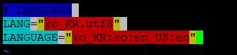
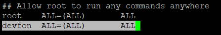

## Spring-boot를 활용한 TO-DO List
TO-DO list 서버: 106.10.41.113:8080/item/list
<br>
REST API 서버: 106.10.41.113:8081/api/items
<br><br>
_수업용으로 제공 받은 저용량 서버라 반응 속도가 상당히 느립니다.._
<br>

### SKill stack
- Java 8
- Spring boot 2.0.6
- Thymeleaf
- MySQL
- Cent OS 7
- Naver Cloud Platform
<br><br>

### basic set up and installation
- kernel update

```
sudo yum update
```

- basic settings

```
# user 추가
adduser devfon

# user 비밀번호 변경
passwd devfon

# 추가한 user 계정으로 이동
cd /home/devfon

# 추가한 user 계정에 sudoer 권한 부여 (그림 1) 참조
vi /etc/sudoers

# UTF-8 인코딩 설정
sudo localectl set-locale LANG=ko_KR.utf8

# .bash_profile에 LANG 정보 추가 (그림 2) 참조
vi .basn_profile 
source .bash_profile
```

- install JDK

```
# JDK 설치
sudo yum install java-1.8.0-openjdk-devel.x86_64
rpm -qa java*jdk-devl

# JAVA path 설정
vi .bash.profile
source .bash_profile

# java version 확인
javac -version

```

- insatll git

```
# 의존 패키지 설치
yum install curl-devel expat-devel gettext-devel \
  openssl-devel zlib-devel

# git 설치
sudo yum install git

# git version 확인
git --version

```

- install mysql

```
# mysql 설치 및 실행
yum install mysql-server
servcie mysqld start
```


<br><br>

### MySQL 
```
# MySQL 로그인
mysql -u root -p
Enter password: *******

# Database 생성
CREATE DATABASE HUFFON;
```
<br><br>

### git
```
# repository 복사
git clone https://github.com/Huffon/to-do-list-spring-boot.git

# 디렉토리 이동 및 권한 설정
cd to-do-list-spring-boot/to-do/to-do
chmod 755 gradlew

cd to-do-list-spring-boot/rest/rest
chmod 755 gradlew

# 빌드 후, jar 파일 실행
cd to-do-list-spring-boot/rest/rest
./gradlew build
java -jar rest-0.0.x-SNAPSHOT.jar

cd to-do-list-spring-boot/to-do/to-do
./gradlew build
java -jar to-do-0.0.x-SNAPSHOT.jar
```

<br><br>

### 배포 쉘 스크립트 (해당 사이트를 [참조](https://jojoldu.tistory.com/263) 하였습니다.)
```
# to-do.sh
#!/bin/bash
REPOSITORY=/home/devfon/app
cd $REPOSITORY/to-do-list-spring-boot/to-do/to-do

echo "> 프로젝트 Build"
./gradlew build

echo "> Build 파일 복사"
cp ./build/libs/*.jar $REPOSITORY/

CURRENT_PID=$(pgrep -f to-do)

echo "$CURRENT_PID"

if [ -z $CURRENT_PID ] ; then
        echo "> 현재 구동 중인 어플리케이션이 없습니다."
else
        echo "> kill -2 $CURRENT_PID"
        kill -9 $CURRENT_PID
        sleep 5
fi

echo "> 새 어플리케이션 배포"

JAR_NAME=$(ls $REPOSITORY/ | grep 'to-do-0.' | tail -n 1)

echo "> JAR Name: $JAR_NAME"

nohup java -jar $REPOSITORY/$JAR_NAME &


# rest.sh
#!/bin/bash
REPOSITORY=/home/devfon/app/
cd $REPOSITORY/to-do-list-spring-boot/rest/rest

echo "> 프로젝트 Build"
./gradlew build

echo "> Build 파일 복사"
cp ./build/libs/*.jar $REPOSITORY/

CURRENT_PID=$(pgrep -f rest)

echo "$CURRENT_PID"

if [ -z $CURRENT_PID ] ; then
        echo "> 현재 구동 중인 어플리케이션이 없습니다."
else
        echo "> kill -2 $CURRENT_PID"
        kill -9 $CURRENT_PID
        sleep 5
fi

echo "> 새 어플리케이션 배포"

JAR_NAME=$(ls $REPOSITORY/ | grep 'rest' | tail -n 1)

echo "> JAR Name: $JAR_NAME"

nohup java -jar $REPOSITORY/$JAR_NAME &
```


<br><br>

### 참조 그림
- 그림 1 <br>


- 그림 2 <br>
